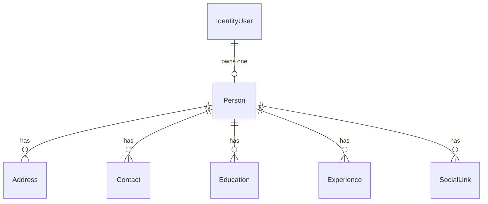

# Profile & CV Management System

> A web-based profile management and CV builder built with **ASP.NET Core MVC**, **Entity Framework Core**, and **SQL Server**.

[](https://dotnet.microsoft.com/)
[](https://learn.microsoft.com/aspnet/core/mvc/overview)
[](https://learn.microsoft.com/ef/core/)
[](https://www.microsoft.com/sql-server)
[](https://getbootstrap.com/)
[](LICENSE.txt)

Every registered user owns exactly **one profile**, composed of related sections — addresses, contacts,
education, experience, and social links. That profile can be rendered as a single, shareable, print-friendly
**CV page**.

---

## Table of Contents

- [Overview](#overview)
- [Features](#features)
  - [Authentication & Accounts](#authentication--accounts)
  - [Profile Management](#profile-management)
  - [Administration](#administration-admin-role-only)
  - [Data & Infrastructure](#data--infrastructure)
- [Tech Stack](#tech-stack)
- [Project Structure](#project-structure)
- [Data Model](#data-model)
- [Prerequisites](#prerequisites)
- [Getting Started](#getting-started)
- [Usage](#usage)
- [Routes Reference](#routes-reference)
- [Image Uploads](#image-uploads)
- [Security Notes](#security-notes)
- [Known Limitations & Roadmap](#known-limitations--roadmap)
- [Code Review Notes](#code-review-notes)
- [Contributing](#contributing)
- [License](#license)

---

## Overview

This application solves a simple problem: **one person, one profile, many sections, one CV.**

Instead of scattering personal details across documents, each user builds a structured profile once and the
system assembles it into a consolidated CV. Administrators get a read-only bird's-eye view of every profile
and a user-management console, with strict ownership enforcement ensuring users can only ever touch their own
data.

---

## Features

### Authentication & Accounts

| Feature                       | Description                                                                                                                                                          |
| ----------------------------- | -------------------------------------------------------------------------------------------------------------------------------------------------------------------- |
| **Register / Login / Logout** | Email + password via ASP.NET Core Identity (PBKDF2 hashing)                                                                                                          |
| **First-user-is-admin**       | The first registered account is automatically assigned the `Admin` role; every subsequent account receives `User`. Both roles are created on demand at registration. |
| **My Account**                | View account info and roles, change phone number, change password                                                                                                    |
| **Custom auth cookie**        | `/Account/Login` and `/Account/AccessDenied` paths configured explicitly                                                                                             |
| **Role-based routing**        | Admins are redirected to the admin panel on login, from the home page, and from `My Profile`                                                                         |

### Profile Management

**Core profile CRUD** — one profile per user, holding personal details, gender, date of birth, religion,
blood group, and a professional summary.

**Photo upload** — validated image uploads with unique GUID filenames; the previous file is deleted from disk
when replaced.

**Date of birth validation** — a date after today is rejected twice over: the date picker greys out future
dates in the browser, and a `NotFutureDate` validation attribute rejects them on the server, so the rule
still holds if the browser check is bypassed.

**Contact value format check** — picking `Email` or `Phone` in the Add Contact modal runs a format check on
the value before the form is allowed to submit. `Other` accepts free text.

**Related section CRUD** — each section supports a full Create / Edit / Delete cycle and is always scoped to
the signed-in user's own profile:

| Section          | Fields                                                                                                  | Special Behavior                                                                   |
| ---------------- | ------------------------------------------------------------------------------------------------------- | ---------------------------------------------------------------------------------- |
| **Addresses**    | Typed address entries                                                                                   | Single `IsPrimary` flag per profile — setting one automatically unset's the others |
| **Contacts**     | Type (email, phone, etc.), value                                                                        | Same single-primary rule as addresses                                              |
| **Education**    | Degree level, degree, institution, board/university, year range, ongoing flag, result                   | Sorted newest first on the CV                                                      |
| **Experience**   | Company, designation, department, employment type, location, date range, current flag, responsibilities | Sorted newest first on the CV                                                      |
| **Social Links** | Platform + validated URL                                                                                | URL format validated on input                                                      |

**CV page** — `/Profile/Cv/{id}` renders one consolidated, print-friendly document pulling together the
profile, all addresses, contacts, education, experience, and social links. Reachable from both **My Profile**
and the admin **Details** page.

**Cascade delete** — deleting a profile removes all of its related sections and its photo from disk.

### Administration (`Admin` role only)

- **All Profiles** — every profile in the system with photo, gender, DOB, blood group, primary city, and creation date
- **Profile Details** — full read-only view of any profile and all of its sections, with a direct link to its CV
- **User Management** — list all users and delete an account along with its profiles, related sections, and photo.
  Self-deletion is blocked.

### Data & Infrastructure

- **Ownership enforcement** — every edit/delete query matches both the requested record ID _and_ the current
  user's profile ID, so users cannot touch other people's data
- **Audit fields** — `CreatedAt` / `CreatedBy` / `UpdatedAt` / `UpdatedBy` on every entity
- **Service layer** — image handling lives behind `IImageService` and is injected via DI rather than inlined
  in controllers
- **Custom validation attributes** — reusable rules such as `NotFutureDate` live in `Data/Validations/` and are
  applied with a plain attribute, so no extra code is needed in the controller
- **Responsive UI** — Bootstrap 5 with a shared layout and navbar

---

## Tech Stack

| Technology                         | Version          |
| ---------------------------------- | ---------------- |
| .NET                               | 10.0 (`net10.0`) |
| ASP.NET Core MVC                   | 10.0             |
| Entity Framework Core (SQL Server) | 10.0.12          |
| ASP.NET Core Identity              | 10.0.12          |
| Bootstrap                          | 5                |

---

## Project Structure

```text
├── Controllers/
│   ├── AccountController.cs         # Register, login, logout, account, change password
│   ├── HomeController.cs            # Entry point; routes admins to the admin panel
│   ├── ProfileController.cs         # Profile CRUD + CV view
│   ├── AddressController.cs         # Address CRUD (owned by current user)
│   ├── ContactController.cs         # Contact CRUD (owned by current user)
│   ├── EducationController.cs       # Education CRUD (owned by current user)
│   ├── ExperienceController.cs      # Experience CRUD (owned by current user)
│   ├── SocialLinkController.cs      # Social link CRUD (owned by current user)
│   ├── AdminController.cs           # [Admin] profile list + details
│   └── UserManagementController.cs  # [Admin] user list + delete
├── Data/
│   ├── AppDbContext.cs              # IdentityDbContext + Persons/Addresses/Contacts/
│   │                                # Educations/Experiences/SocialLinks DbSets
│   └── Validations/
│       └── NotFutureDateAttribute.cs# Rejects a date that is in the future
├── Models/
│   ├── Person.cs                    # Root profile entity + navigation collections
│   ├── Address.cs
│   ├── Contact.cs
│   ├── Education.cs
│   ├── Experience.cs
│   ├── SocialLink.cs
│   └── ErrorViewModel.cs
├── Services/
│   ├── ImageService.cs              # Save / delete / validate uploaded images
│   ├── ProfileCompletenessService.cs# Scores how much of a profile is filled in
│   └── Interfaces/
│       ├── IImageService.cs
│       └── IProfileCompletenessService.cs
├── ViewModels/
│   ├── Profile/                     # Create, Edit, Delete, Index, Cv view models
│   ├── AddressViewModels/           # Create, Edit, Delete
│   ├── ContactViewModels/
│   ├── EducationViewModels/
│   ├── ExperienceViewModels/
│   ├── SocialLinkViewModels/
│   ├── AdminViewModels/             # Profile list + details
│   ├── ProfileViewModel.cs          # Account profile
│   ├── EditProfileViewModel.cs
│   ├── ChangePasswordViewModel.cs
│   └── UserDeleteViewModel.cs
├── Views/
│   ├── Account/                     # Login, Register, Profile, EditProfile, ChangePassword, AccessDenied
│   ├── Home/                        # Index
│   ├── Profile/                     # Create, Edit, Delete, Index, Cv
│   ├── Address/                     # Create, Edit, Delete
│   ├── Contact/
│   ├── Education/
│   ├── Experience/
│   ├── SocialLink/
│   ├── Admin/                       # Index, Details
│   ├── UserManagement/              # Index, Delete
│   └── Shared/                      # _Layout, _ValidationScriptsPartial, Error
├── Migrations/                      # EF Core migrations (InitialCreate)
├── wwwroot/                         # Static files, uploads/profiles for profile photos
├── appsettings.json
└── Program.cs
```

---

## Data Model



```text
Person (1) ──┬── (N) Address
             ├── (N) Contact
             ├── (N) Education
             ├── (N) Experience
             └── (N) SocialLink
```

- `Person.UserId` links a profile to its owning ASP.NET Core Identity user.
- The owner is the built-in `IdentityUser` class from ASP.NET Core Identity — this project does not define a
  custom `ApplicationUser`, and every `UserManager<IdentityUser>` call uses that type directly.
- All child entities carry a `PersonId` foreign key plus the audit fields
  `CreatedAt` / `CreatedBy` / `UpdatedAt` / `UpdatedBy`.

---

## Prerequisites

- [.NET 10 SDK](https://dotnet.microsoft.com/download)
- **SQL Server Express** or **LocalDB** — the default connection targets `localhost\SQLEXPRESS`
- Optional: the [`dotnet-ef`](https://learn.microsoft.com/ef/core/cli/dotnet) global tool for managing migrations

---

## Getting Started

### 1. Restore packages

```bash
dotnet restore
```

### 2. Configure the database connection

Edit `appsettings.json` if your SQL Server instance differs. The default:

```text
Server=localhost\SQLEXPRESS;Database=CustomerManagementDb;Trusted_Connection=True;TrustServerCertificate=True;
```

A commented-out **LocalDB** connection string is included as an alternative.

### 3. Apply migrations

```bash
dotnet ef database update
```

### 4. Run the application

```bash
dotnet run
```

With the default `https` launch profile, the app is available at:

- <https://localhost:7061>
- <http://localhost:5258>

---

## Usage

1. **Open the app** in a browser.
2. **Register** — the very first account created becomes an **Admin**; all later accounts become **Users**.
   The `Admin` and `User` roles are created automatically.
3. **Log in** — admins land on the profile list, regular users land on their own profile.
4. **As a User**, go to **My Profile** and create your profile (photo optional). From there you can add
   addresses, contacts, education, experience, and social links, then open **View CV** to see the consolidated
   document.
5. **As an Admin**, use **Profiles** to browse every profile and open its details or CV, and **Users** to
   manage accounts.

---

## Routes Reference

| Route                 | Access        | Purpose                          |
| --------------------- | ------------- | -------------------------------- |
| `/`                   | Public        | Entry point; redirects by role   |
| `/Profile`            | Authenticated | Current user's profile dashboard |
| `/Profile/Cv/{id}`    | Public        | Rendered CV for a profile        |
| `/Admin`              | Admin         | All profiles                     |
| `/Admin/Details/{id}` | Admin         | Full profile details             |
| `/UserManagement`     | Admin         | All users                        |
| `/Account/Login`      | Public        | Login                            |
| `/Account/Register`   | Public        | Register                         |

---

## Image Uploads

Profile photos are handled by `IImageService`:

- **Allowed extensions:** `.jpg`, `.jpeg`, `.png`, `.gif`, `.webp`
- **Storage location:** `wwwroot/uploads/profiles/`
- **Naming:** each file receives a GUID-based name, so uploads never collide
- **Cleanup:** replacing or deleting a profile photo removes the previous file from disk

---

## Security Notes

- **Ownership enforcement** is applied at the query level — edit and delete operations match on both the
  record ID _and_ the current user's profile ID.
- **Password storage** uses ASP.NET Core Identity's PBKDF2 hashing.
- **Role separation** — administrative controllers are protected with `[Authorize(Roles = "Admin")]`.
- **Self-deletion is blocked** in the user-management console.
- ⚠️ **The CV page is currently `[AllowAnonymous]`** — any CV is reachable by ID without logging in.
  See [Known Limitations](#known-limitations--roadmap).

---

## Known Limitations & Roadmap

| Item                   | Status / Notes                                                                                                                                                                                              |
| ---------------------- | ------------------------------------------------------------------------------------------------------------------------------------------- |
| **Standalone address/contact pages** | `/Address/Create` and `/Contact/Create` render a normal HTML form, but the matching POST actions are marked `[FromBody]` and expect JSON. Submitting either page therefore returns *415 Unsupported Media Type*. The AJAX modals on the profile page are unaffected. Either drop `[FromBody]` from those two actions or delete the unused pages. See [`CODE_REVIEW_NOTES.md`](CODE_REVIEW_NOTES.md) §1.1. |
| **Soft delete**        | `Deleted` flags exist on the entity classes, but current delete actions perform **hard deletes**. The soft-delete block in `ProfileController.DeleteConfirmed` is commented out and ready to be re-enabled. No query filters on the flag yet, so it must not be used until a global query filter is added. |
| **Public CV access**   | `ProfileController.Cv` is marked `[AllowAnonymous]`, so any CV is reachable by ID without authentication. Consider requiring auth or adding a share token. |
| **No anti-forgery check** | No POST action uses `[ValidateAntiForgeryToken]` and `app.UseAntiforgery()` is not registered, so the project currently has no CSRF protection. See [`CODE_REVIEW_NOTES.md`](CODE_REVIEW_NOTES.md) §2.1. |
| **Connection string**  | The live connection string is committed in `appsettings.json`. Move it to user secrets before sharing the repository. It uses Windows authentication, so no password is stored. |
| **Registration input** | `AccountController.Register` accepts a plain `email` and `password` rather than a dedicated view model.                                                                                                     |
| **First user is admin** | The `Admin` role is handed to whoever registers when the user table is empty, so a wiped or freshly restored database hands admin rights to the next signup.                                                                                                     |
| **Tests**              | No automated test project is included yet.                                                                                                                                                                  |

---

## Code Review Notes

[`CODE_REVIEW_NOTES.md`](CODE_REVIEW_NOTES.md) is a full intern-level review of this codebase — bugs,
security gaps, dead code and suggested improvements. Every item explains what happens, why it happens, and
the simplest fix, so it doubles as a learning guide. Start there when you are picking up your next task.

Two findings from that review are already resolved:

- **Date of birth can no longer be a future date** — blocked in the browser and rejected on the server by
  `NotFutureDateAttribute`.
- **The Add Contact email/phone check now actually runs** — it previously lived in a `@section` inside a
  partial view, which Razor never renders, and wrote its message into an element that had no `id`.

The remaining findings are tracked in the Known Limitations table above.

---

## Contributing

1. Fork the repository and create a feature branch: `git checkout -b feature/my-change`
2. Follow the existing patterns — view models per action, service layer for cross-cutting concerns,
   and ownership checks on every user-scoped query.
3. Keep migrations focused and descriptively named.
4. Open a pull request describing the change and how it was verified.

### Verifying a change

Run a build before you commit — Razor views are compiled at build time, so a mistake in a `.cshtml` file
(such as writing the literal text `@section` inside a JavaScript comment) fails the build rather than the
page:

```bash
dotnet build
```

For anything touching browser behaviour, check the HTML the server actually returns instead of assuming.
Two bugs in this project were only visible there: a `@section` inside a partial view silently renders
nothing, and `<span asp-validation-for="X">` does not emit an `id`, so a JavaScript selector for it finds
nothing.

---

## License

See [LICENSE.txt](LICENSE.txt).
